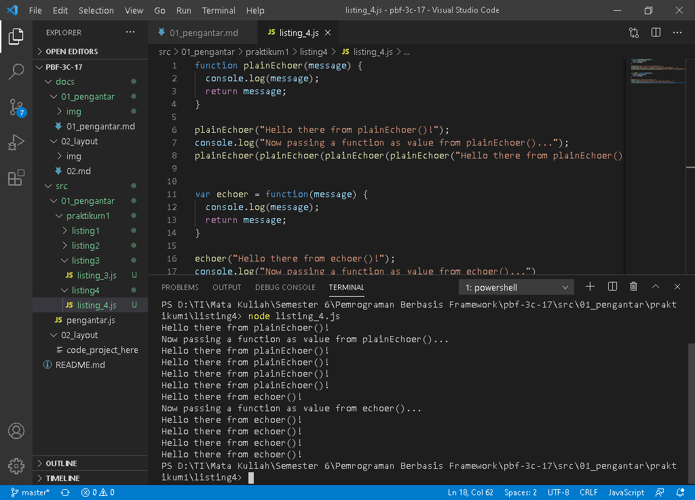
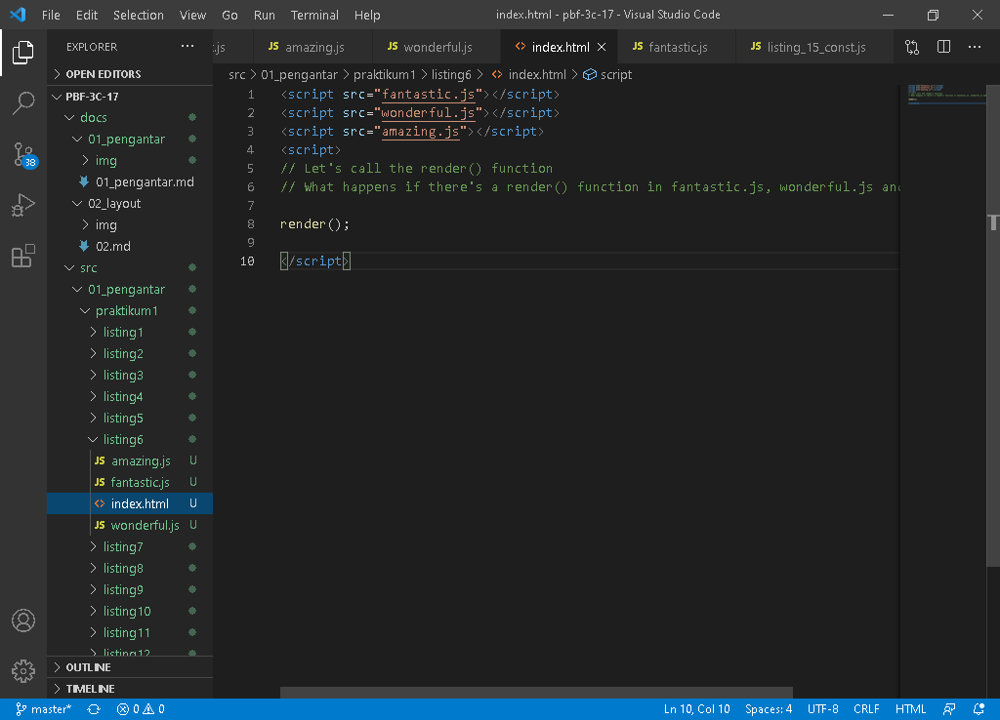
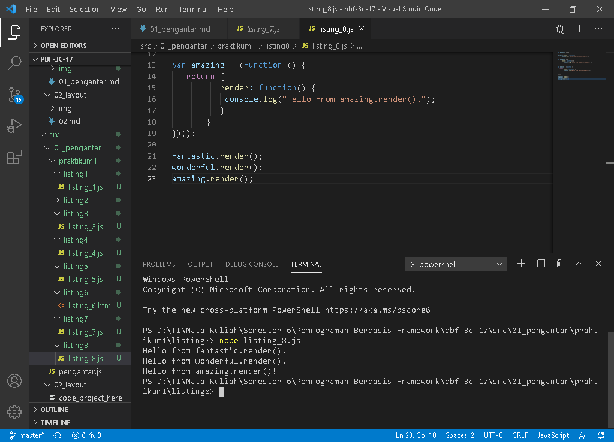
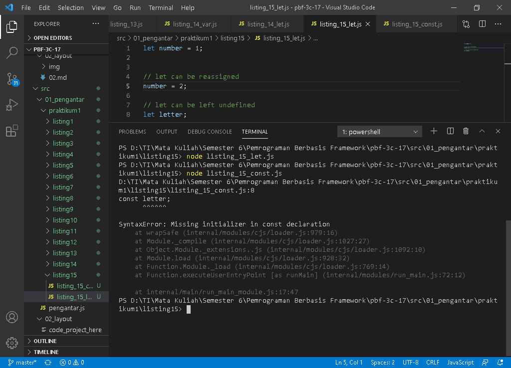

# 01 - Pengantar

## Tujuan Pembelajaran

1. (bisa copy dari RPS kolom sub-CP-MK)
2. dst

## Praktikum 1
***
***Listing 1-1. ES5: var scope behavior***

`Screenshoot`
>
>* [listing_1.js](../../src/01_pengantar/praktikum1/listing1/listing_1.js)
---

***Listing 1-2. ES5: Hoisting behavior***

`Screenshoot`
>
>* [listing_2.js](../../src/01_pengantar/praktikum1/listing2/listing_2.js)
---

***Listing 1-3. ES5: Equality and inequality symbols***

`Screenshoot`
>
>* [listing_3.js](../../src/01_pengantar/praktikum1/listing3/listing_3.js)
---

***Listing 1-4. ES5: Functions as values***

`Screenshoot`
>
>* [listing_4.js](../../src/01_pengantar/praktikum1/listing4/listing_4.js)
---

***Listing 1-5. ES5: Hoisting behavior with function declarations and expressions***

`Screenshoot`
>
>* [listing_5.js](../../src/01_pengantar/praktikum1/listing5/listing_5.js)
---

***Listing 1-6. ES5: Naming conflict due to lack of namespace***

`Screenshoot`
>
>* [index.html](../../src/01_pengantar/praktikum1/listing6/index.html)
>* [amazing.js](../../src/01_pengantar/praktikum1/listing6/amazing.js)
>* [fantastic.js](../../src/01_pengantar/praktikum1/listing6/fantastic.js)
>* [wonderful.js](../../src/01_pengantar/praktikum1/listing6/wonderful.js)
---

***Listing 1-7. ES5: Namespaces with IIFE prevent naming conflicts***

`Screenshoot`
>
>* [listing_7.js](../../src/01_pengantar/praktikum1/listing7/listing_7.js)
---

***Listing 1-8. ES5: Namespaces with object assignment and object notation***

`Screenshoot`
>
>* [listing_8.js](../../src/01_pengantar/praktikum1/listing8/listing_8.js)
---

***Listing 1-9. ES5: Use and lack of block scoping***

`Screenshoot`
>
>* [listing_9.js](../../src/01_pengantar/praktikum1/listing9/listing_9.js)
---
***LListing 1-10. ES5: Execution context or `this` varies depending on lexical scope***

`Screenshoot`
>
>* [listing_10.js](../../src/01_pengantar/praktikum1/listing10/listing_10.js)
---

***Listing 1-11. ES5: Access the same `this` context in different scopes/objects***

`Screenshoot`
>
>* [listing_11.js](../../src/01_pengantar/praktikum1/listing11/listing_11.js)
---

***Listing 1-12. ES5: Closures enclose their lexical scope***

`Screenshoot`
>
>* [listing_12.js](../../src/01_pengantar/praktikum1/listing12/listing_12.js)
---

***Listing 1-13. ES6: `let` block scoping***

`Screenshoot`
>
>* [listing_13.js](../../src/01_pengantar/praktikum1/listing13/listing_13.js)
---

***Listing 1-14. ES6: `let` vs. `var` duplicate and function parameter name clashes***

`Screenshoot`
>
>* [listing_14_let.js](../../src/01_pengantar/praktikum1/listing14/listing_14_let.js)
>* [listing_14_var.js](../../src/01_pengantar/praktikum1/listing14/listing_14_var.js)
---

***Listing 1-15. ES6: `const` vs. `let` behaviors***

`Screenshoot`
>
>* [listing_15_let.js](../../src/01_pengantar/praktikum1/listing15/listing_15_let.js)
>* [listing_15_cons.js](../../src/01_pengantar/praktikum1/listing15/listing_15_cons.js)
---
***Listing 1-16. ES6: Modules with `export` and `import`***

`Screenshoot`
>
>* [amazing.js](../../src/01_pengantar/praktikum1/listing16/amazing.js)
>* [fantastic.js](../../src/01_pengantar/praktikum1/listing16/fantastic.js)
>* [index.html](../../src/01_pengantar/praktikum1/listing16/index.html)
>* [script.js](../../src/01_pengantar/praktikum1/listing16/script.js)
>* [wonderful.js](../../src/01_pengantar/praktikum1/listing16/wonderful.js)
---
***Listing 1-17. ES6: Modules with refined  and `default export` and `import`***

`Screenshoot`
>
>* [amazing.js](../../src/01_pengantar/praktikum1/listing17/amazing.js)
>* [fantastic.js](../../src/01_pengantar/praktikum1/listing17/fantastic.js)
>* [index.html](../../src/01_pengantar/praktikum1/listing17/index.html)
>* [script.js](../../src/01_pengantar/praktikum1/listing17/script.js)
>* [wonderful.js](../../src/01_pengantar/praktikum1/listing17/wonderful.js)
---

***Listing 1-18. ES6: Arrow functions***

`Screenshoot`
>
>* [listing_18.js](../../src/01_pengantar/praktikum1/listing18/listing_18.js)
---

***Listing 1-19. ES6: Arrow function's `this` reference is from their outer scope***

`Screenshoot`
>
>* [listing_19.js](../../src/01_pengantar/praktikum1/listing19/listing_19.js)
---

***Listing 1-20. ES6: Default function parameters***

`Screenshoot`
>
>* [listing_20.js](../../src/01_pengantar/praktikum1/listing20/listing_20.js)
---

***Listing 1-21. ES6: Spread/rest ... operator***

`Screenshoot`
>
>* [listing_21.js](../../src/01_pengantar/praktikum1/listing21/listing_21.js)
---

***Listing 1-22. ES6: Spread/rest ... operator***

`Screenshoot`
>
>* [listing_22.js](../../src/01_pengantar/praktikum1/listing22/listing_22.js)
---
