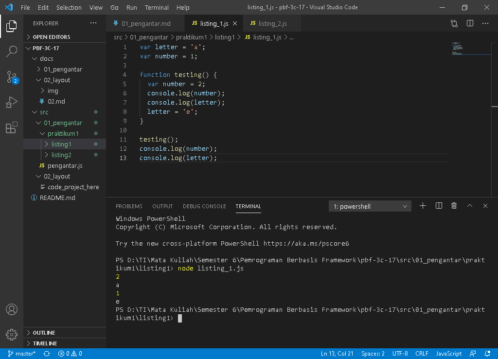
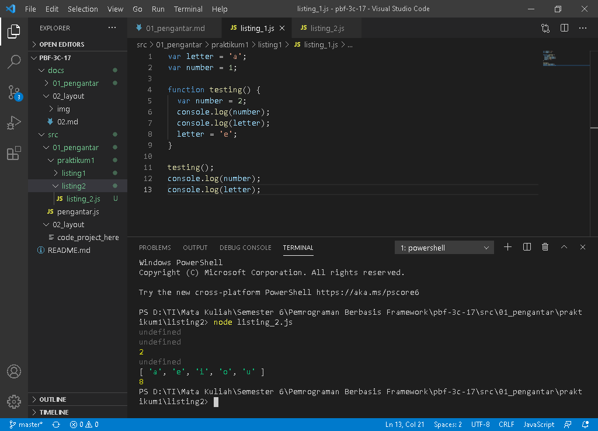
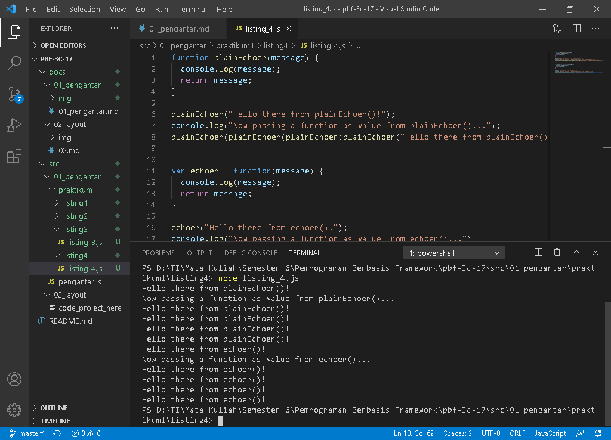
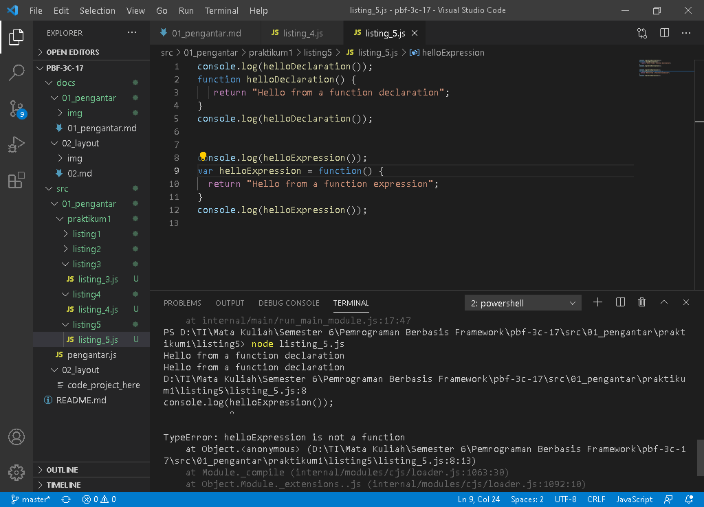
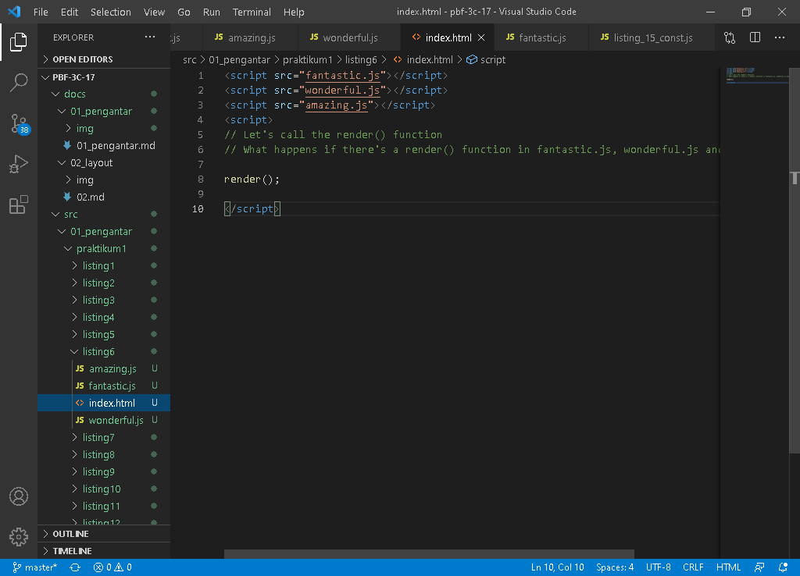
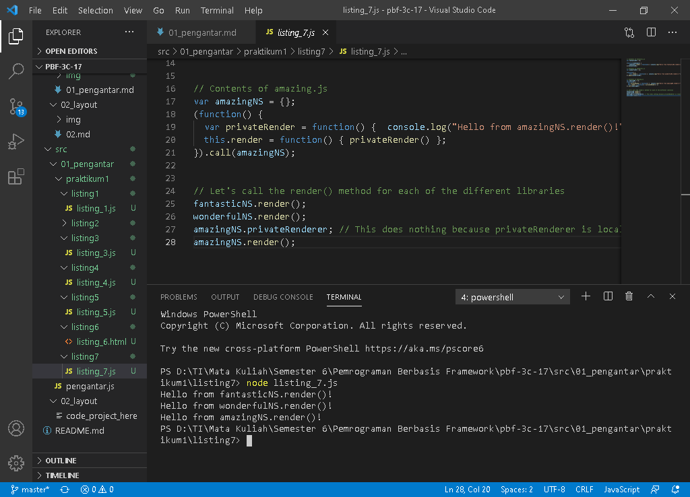
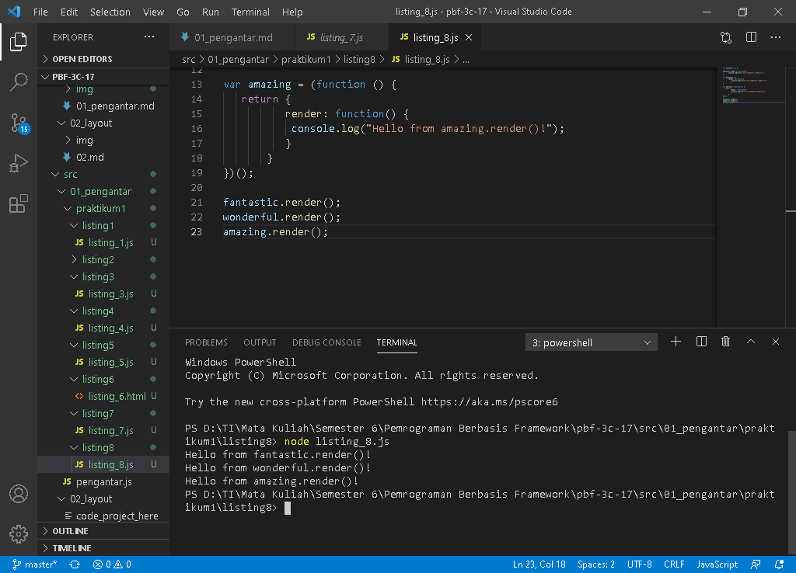
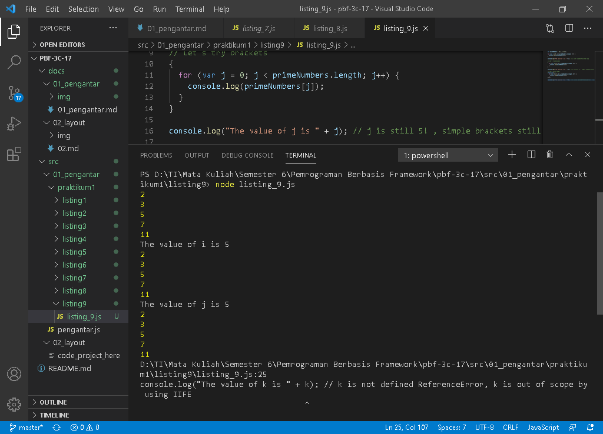
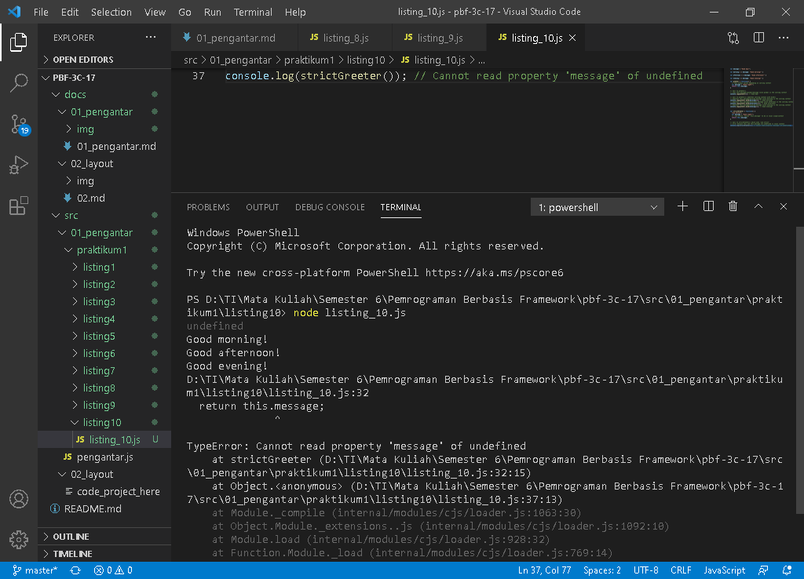
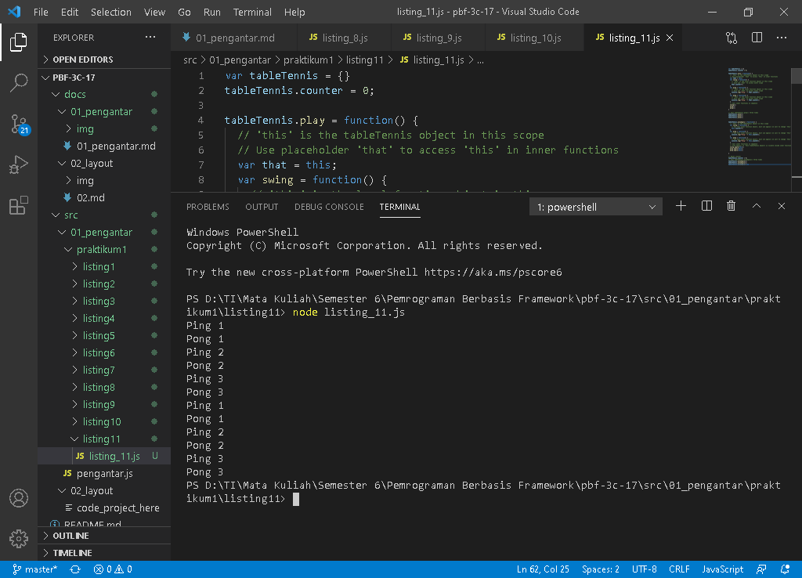

# 01 - Pengantar

## Tujuan Pembelajaran

1. (bisa copy dari RPS kolom sub-CP-MK)
2. dst

## Praktikum 1
***
***Listing 1-1. ES5: var scope behavior***

`Screenshoot`
>
>* [listing_1.js](../../src/01_pengantar/praktikum1/listing1/listing_1.js)
---

***Listing 1-2. ES5: Hoisting behavior***

`Screenshoot`
>
>* [listing_2.js](../../src/01_pengantar/praktikum1/listing2/listing_2.js)
---

***Listing 1-3. ES5: Equality and inequality symbols***

`Screenshoot`
>
>* [listing_3.js](../../src/01_pengantar/praktikum1/listing3/listing_3.js)
---

***Listing 1-4. ES5: Functions as values***

`Screenshoot`
>
>* [listing_4.js](../../src/01_pengantar/praktikum1/listing4/listing_4.js)
---

***Listing 1-5. ES5: Hoisting behavior with function declarations and expressions***

`Screenshoot`
>
>* [listing_5.js](../../src/01_pengantar/praktikum1/listing5/listing_5.js)
---

***Listing 1-6. ES5: Naming conflict due to lack of namespace***

`Screenshoot`
>
>* [index.html](../../src/01_pengantar/praktikum1/listing6/index.html)
>* [amazing.js](../../src/01_pengantar/praktikum1/listing6/amazing.js)
>* [fantastic.js](../../src/01_pengantar/praktikum1/listing6/fantastic.js)
>* [wonderful.js](../../src/01_pengantar/praktikum1/listing6/wonderful.js)
---

***Listing 1-7. ES5: Namespaces with IIFE prevent naming conflicts***

`Screenshoot`
>
>* [listing_7.js](../../src/01_pengantar/praktikum1/listing7/listing_7.js)
---

***Listing 1-8. ES5: Namespaces with object assignment and object notation***

`Screenshoot`
>
>* [listing_8.js](../../src/01_pengantar/praktikum1/listing8/listing_8.js)
---

***Listing 1-9. ES5: Use and lack of block scoping***

`Screenshoot`
>
>* [listing_9.js](../../src/01_pengantar/praktikum1/listing9/listing_9.js)
---
***LListing 1-10. ES5: Execution context or `this` varies depending on lexical scope***

`Screenshoot`
>
>* [listing_10.js](../../src/01_pengantar/praktikum1/listing10/listing_10.js)
---

***Listing 1-11. ES5: Access the same `this` context in different scopes/objects***

`Screenshoot`
>
>* [listing_11.js](../../src/01_pengantar/praktikum1/listing11/listing_11.js)
---