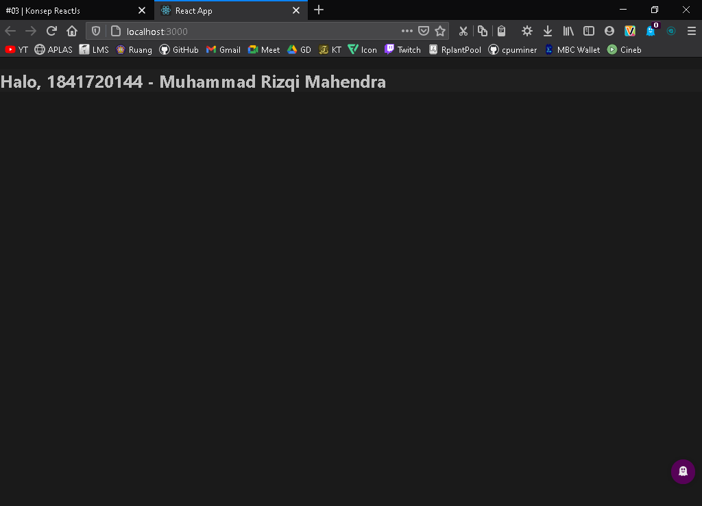
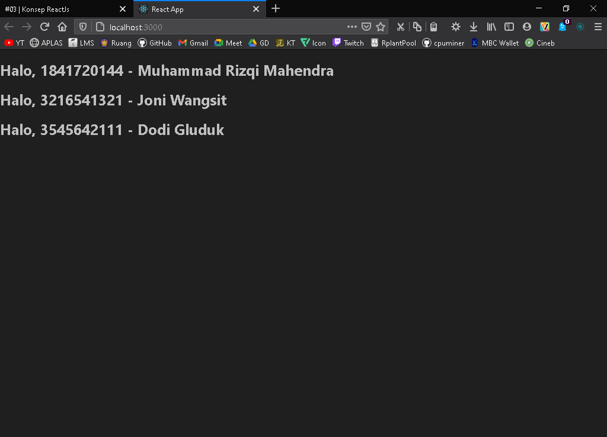

# 03 - Konsep ReactJS

## Tujuan Pembelajaran
- Pengenalan tentang JSX (JavaScript XML)
- Rendering elements
- Penggunaan component dan props
- State dan lifecycle
- Menangani events (Codelab berikutnya)
- Conditional rendering (Codelab berikutnya)
- Penggunaan Lists dan Keys (Codelab berikutnya)
- Penggunaan Forms (Codelab berikutnya)

***

## Praktikum 1: Embedding Expression di JSX 

***

`Screenshoot`
>
>* [index.js](../../src/03_Konsep_ReactJS/praktikum1/1.1/index.js)

`Screenshoot`
>
>* [index.js](../../src/03_Konsep_ReactJS/praktikum1/1.2/index.js)

## Praktikum 2: Melakukan Update Render Element

***

`Screenshoot`
>
>* [index.js](../../src/03_Konsep_ReactJS/praktikum2/index.js)

## Praktikum 3: Rendering Sebuah Component

***

`Screenshoot`
>
>* [index.js](../../src/03_Konsep_ReactJS/praktikum3/index.js)

## Praktikum 4: Menggabungkan beberapa Components

***

`Screenshoot`
>
>* [index.js](../../src/03_Konsep_ReactJS/praktikum4/index.js)
>* [App.js](../../src/03_Konsep_ReactJS/praktikum4/App.js)

