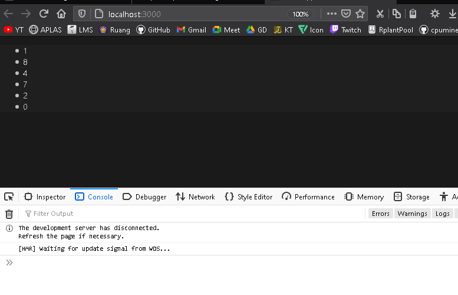
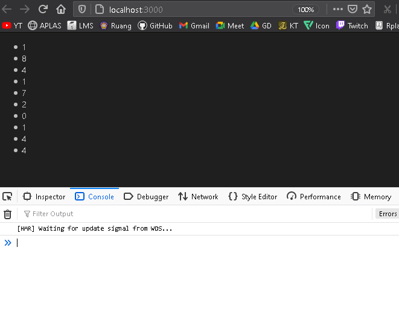

# 03 - Konsep ReactJS Bagian 2

## Tujuan Pembelajaran
-   Pengenalan tentang JSX (JavaScript XML) (Codelab sebelumnya)
-   Rendering elements (Codelab sebelumnya)
-   Penggunaan component dan props (Codelab sebelumnya)
-   State dan lifecycle (Codelab sebelumnya)
-   Menangani events
-   Conditional rendering
-   Penggunaan Lists dan Keys
-   Penggunaan Forms

***
## Praktikum 1: Menangani events pada toggle button

### Cara 1: Membuat toggle button dengan binding this

`Screenshoot`
>
>
>* [index.js](../../src/04_konsep_reactjs_part2/praktikum1/1.1/index.js)

### Cara 2: Membuat toggle button dengan class field dan arrow function

`Screenshoot`
>
>
>* [index.js](../../src/04_konsep_reactjs_part2/praktikum1/1.2/index.js)

### Cara 3: Membuat toggle button dengan arrow function saat pemanggilan

`Screenshoot`
>
>
>* [index.js](../../src/04_konsep_reactjs_part2/praktikum1/1.3/index.js)

## Praktikum 2: Rendering login secara kondisional

`Screenshoot`
>
>* [index.js](../../src/04_konsep_reactjs_part2/praktikum2/index.js)

## Praktikum 3: Menyimpan elements dengan variabel

`Screenshoot`
>
>
>* [index.js](../../src/04_konsep_reactjs_part2/praktikum3/index.js)

## Praktikum 4: Komponen list dasar

`Screenshoot`
>
>
>
>* [1.1 index.js](../../src/04_konsep_reactjs_part2/praktikum4/1.1/index.js)
>* [1.2 index.js](../../src/04_konsep_reactjs_part2/praktikum4/1.2/index.js)
>* [1.3 index.js](../../src/04_konsep_reactjs_part2/praktikum4/1.3/index.js)

## Praktikum 5: Membuat unique keys

`Screenshoot`
>
>* [index.js](../../src/04_konsep_reactjs_part2/praktikum5/index.js)

## Praktikum 6: Membuat form dengan controlled components

`Screenshoot`
>
>* [form index.js](../../src/04_konsep_reactjs_part2/praktikum6/1.1/index.js)

>
>* [textarea index.js](../../src/04_konsep_reactjs_part2/praktikum6/1.2/index.js)

>
>* [select index.js](../../src/04_konsep_reactjs_part2/praktikum6/1.3/index.js)

>
>* [multiple-select index.js](../../src/04_konsep_reactjs_part2/praktikum6/1.4/index.js)