# 05 - API dan Router di ReactJs

## Apa yang Anda akan pelajari
-   Mengambil data dari API
-   Membuat routing di ReactJS
***
### Praktikum 1: Menampilkan data dari API
`Screenshoot`
>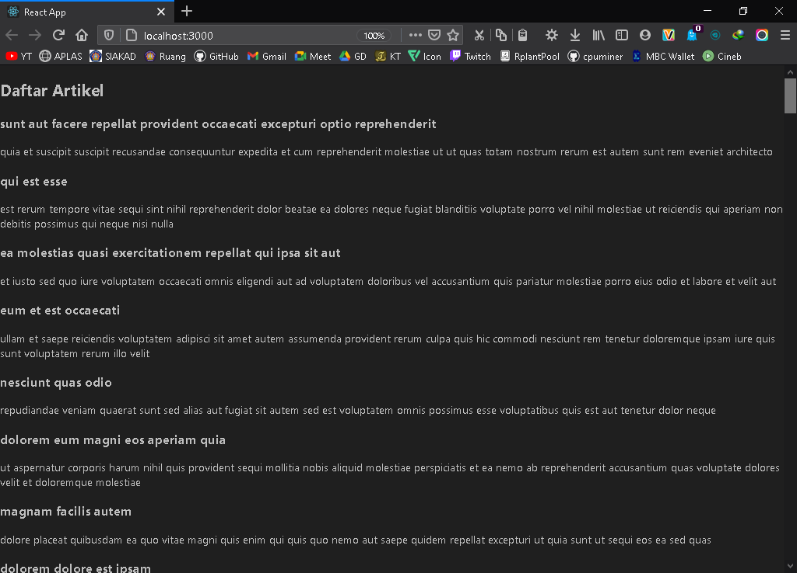
>* [index.js](../../src/05_api_router_reactjs/praktikum1/index.js)

***

### Praktikum 2: Membuat routing sederhana

`Screenshoot`
>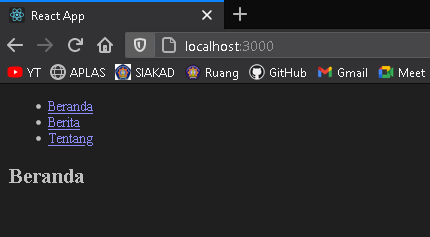
>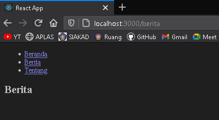
>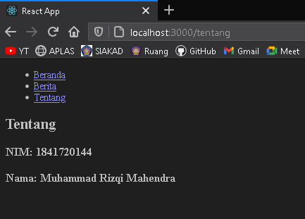
>* [App.js](../../src/05_api_router_reactjs/praktikum2/App.js)
>* [index.js](../../src/05_api_router_reactjs/praktikum2/index.js)

***
### Praktikum 3: Membuat routing bersarang (Nested Routing)

`Screenshoot`
>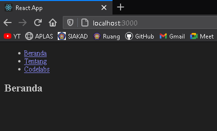
>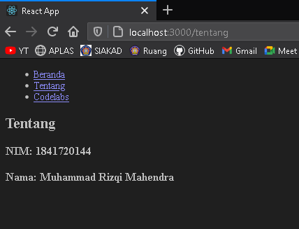
>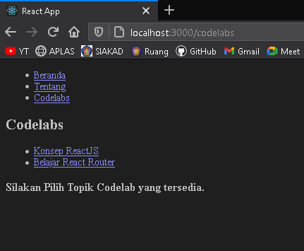
>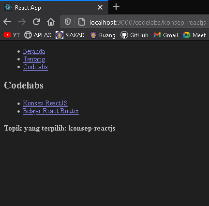
>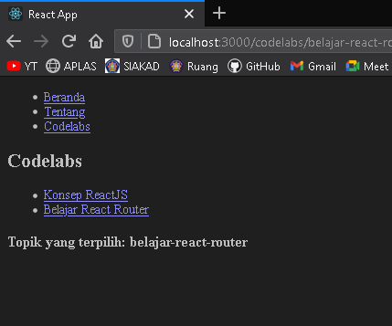
>* [App.js](../../src/05_api_router_reactjs/praktikum3/App.js)

***

### Tugas Praktikum
>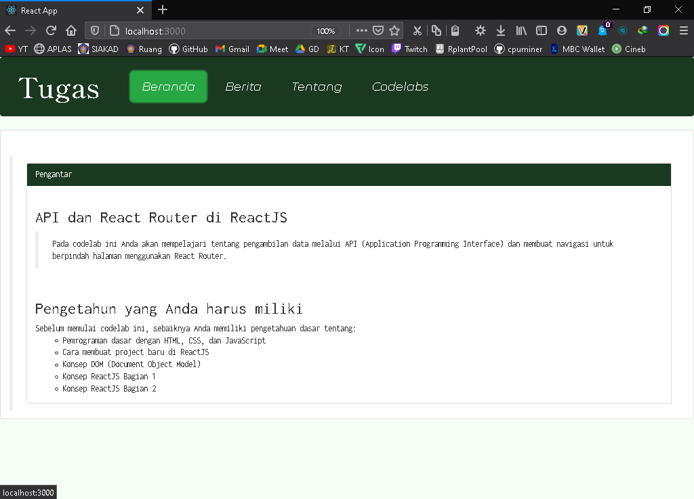
>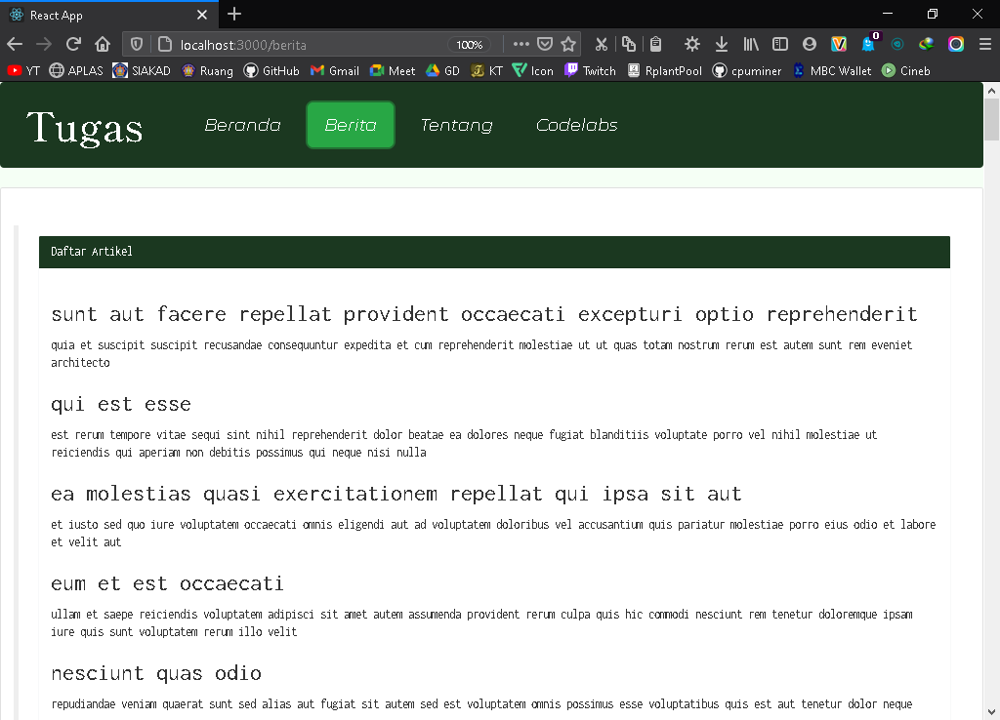
>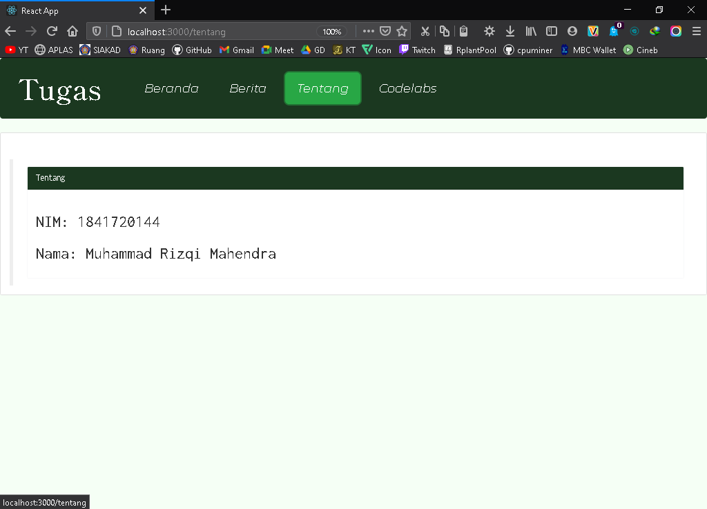
>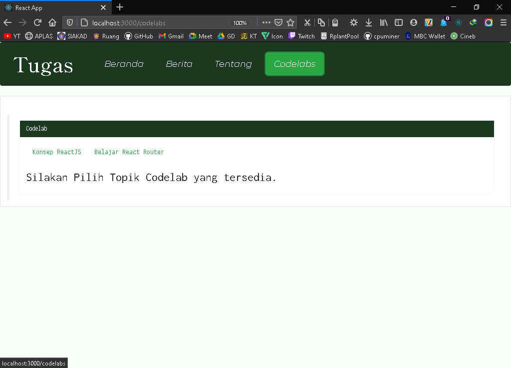
>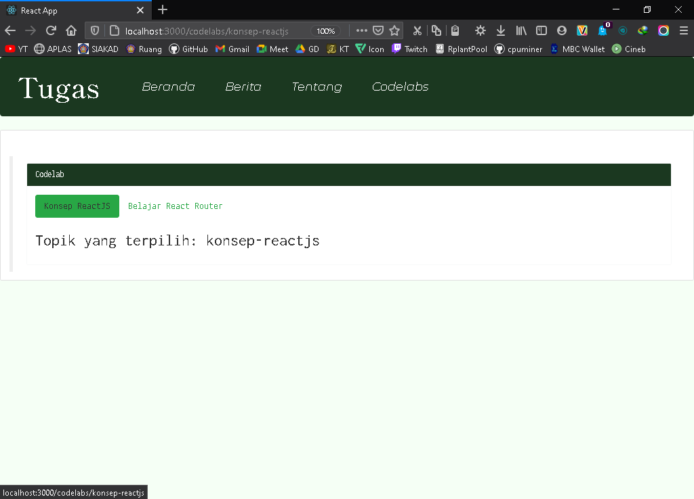
>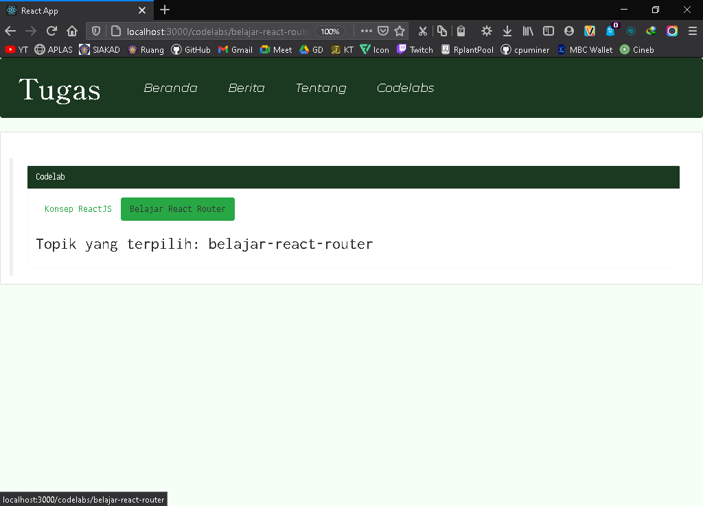

