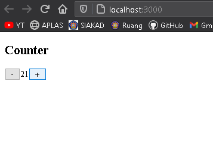
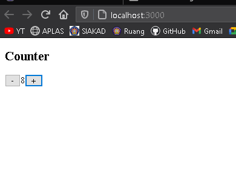
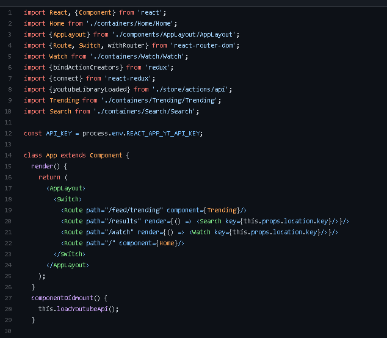
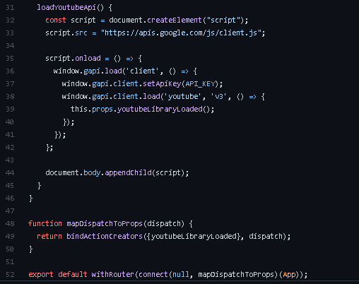

# 06 - React Redux

## Tujuan Pembelajaran
-   Konsep Redux dan manfaatnya
-   Instalasi dan konfigurasi Redux di ReactJS
-   Membuat aplikasi sederhana dengan Redux di ReactJS

___
## Praktikum: Membuat Aplikasi Counter Sederhana

* Aplikasi counter  tanpa menggunakan redux  

* Aplikasi counter menggunakan redux  

* [App.js](../../src/06_redux/App.js)  
* [index.js](../../src/06_redux/index.js)

## Tugas (Pertanyaan Praktikum)

1.  Jelaskan maksud sintaks `this.props.dispatch` pada praktikum langkah 16 sebelumnya!  
`Jawab`  
Untuk mengambil data pada store

2.  Jelaskan maksud istilah yang ada dalam Redux berikut ini:
* `Actions`  
 action merupakan sebuah object yang memiliki property type
 
* `Reducers`  
Reducer adalah bagian redux yang merubah state menjadi respon yang terjadi ketika Action di `dispatch()`
* `Action creators`  
fungsi yang mengembalikan nilai action
* `Middleware`  
 merupakan sebuah alat yang digunakan untuk merubah hasil dari request sebelum masuk menjadi response

* `Pure functions`  
berarti tidak boleh ada sebuah logic yang digunakan di dalamnya.

* `Immutability`  
is something that cannot be changed, this means that instead of having traditional variables, you’d be constantly creating new values and replacing old ones.

3.  Jelaskan maksud sintaks `export default connect(mapStateToProps)(Counter)` pada praktikum langkah 9 sebelumnya!   
`Jawab`  
Untuk menghubungkan komponent dan store kemudian mapStateToProps untuk mengambil state dari store dimana data dari store akan masuk pada komponent sebagai pops

4.  Carilah sebuah studi kasus aplikasi yang cukup kompleks di GitHub yang memanfaatkan Redux! Kemudian screenshot bagian kode program mana yang merupakan proses Redux dan jelaskan prosesnya! (cantumkan link repository GitHub yang Anda temukan)  
`Jawab`  
  
Aplikasi ini berupa API Data Youtube menggunakan React-Redux. Bisa dilihat pada code program diatas terdapat proses import redux. yang berupa `bindActionCreator` dan `connect`  
  
pada code program diatas 
komponent akan dihubungkan ke store kemudian 
function `mapDispatchToProps` untuk mengambil data dari store. Dimana data dari store akan masuk pada komponent sebagai pops.

`Source` https://github.com/productioncoder/youtube-react