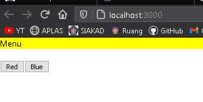
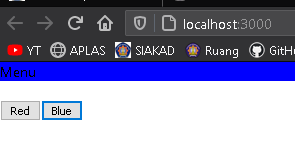

# 06 - React Redux

## Tujuan Pembelajaran
- Konsep Context dan manfaatnya
- Konsep HOC di ReactJS

___
## Praktikum: Membuat Tema Aplikasi Sederhana

  
  
  

* [App.js](../../src/07_context_hoc/App.js)     
* [index.js](../../src/07_context_hoc/index.js)  
* [Menu.js](../../src/07_context_hoc/Menu.js)  
* [SetColor.js](../../src/07_context_hoc/SetColor.js)  
* [theme-context.js](../../src/07_context_hoc/ThemeContext/theme-context.js)  
* [ThemeProvider.js](../../src/07_context_hoc/ThemeContext/ThemeProvider.js)  
* [withTheme.js](../../src/07_context_hoc/ThemeContext/withTheme.js)  

