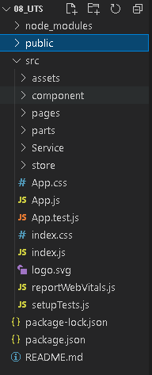
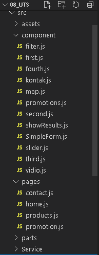
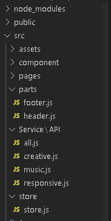

# 08 - UTS

## Aplikasi React(SPA)

___
### Struktur Projek

 
 

  

`Kode   :`
[Folder](../../src/08_UTS/src/)     

`Home Page`  

  
`Kode   :`
[home.js](../../src/08_UTS/src/pages/Home/home.js)  

`Promotion`  

  
`Kode   :`
[promotion.js](../../src/08_UTS/src/pages/Promotion/promotion.js)  

`Products`  
* Products-All  
   
* Products-Music  
  
* Products-Creative  
  
* Products-Responsive  
    
`Kode   :`
[products.js](../../src/08_UTS/src/pages/Products/products.js)  

`Contact`  

  
`Kode   :`
[contact.js](../../src/08_UTS/src/pages/Contact/contact.js)  

### React Router  
  
`Kode   :`
[App.js](../../src/08_UTS/src/App.js)  

### API  
  
`Kode   :`
- [products.js](../../src/08_UTS/src/products.js)  
- [API](../../src/08_UTS/src/parts/API/)
- [Json](https://github.com/mahe62/mahe62.github.io/blob/master/db.json)