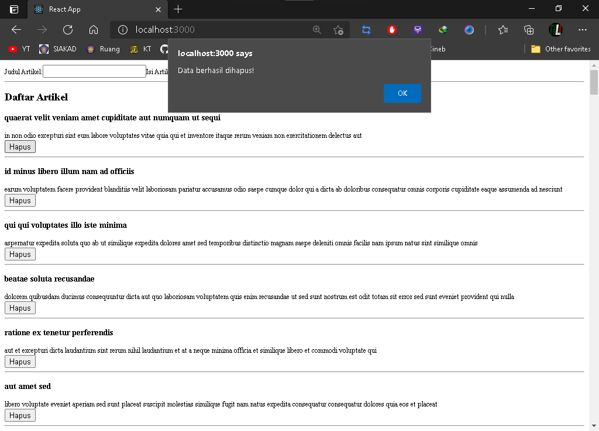

# Laporan Praktikum #9

## Tujuan Pembelajaran

1. Mahasiswa mengetahui dan memahami konsep Global API

## Kode Program

`Kode Program:`  

* [Kode Program](../../src/09_global_api_hooks)

## Praktikum

### Membuat Restful API Lokal

`Screenshot:`  

### Membuat Global API Service POST

`Screenshot:`  

### Membuat Global API Service DELETE

`Screenshot:`  

### Mengelola Global API Service

`Screenshot:`  

### Tugas Praktikum 1

