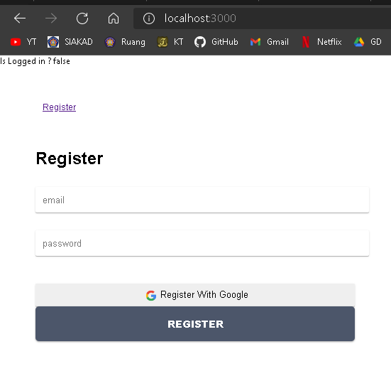
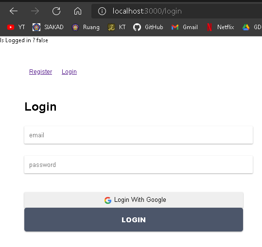
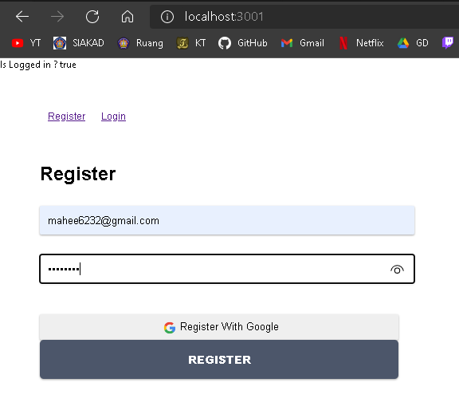
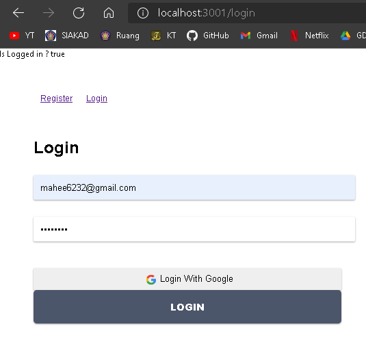

# Laporan Praktikum #9

## Tujuan Pembelajaran

1. Mahasiswa mengetahui dan memahami konsep Global API

## Kode Program

`Kode Program:`  

* [Kode Program](../../src/09_global_api_hooks)

## Praktikum

### Praktikum 1: Membuat Form Register

`Screenshot:`  

  
`Kode Program:`  

* [Kode Program](../../src/10_firebase_reactjs/praktikum1/src)

### Praktikum 2: Membuat Form Login

`Screenshot:`  

  
`Kode Program:`  

* [Kode Program](../../src/10_firebase_reactjs/praktikum2/src)

### Praktikum 3: Membuat Koneksi ke Firebase

`Screenshot:`  

  
  
`Kode Program:`  

* [Kode Program](../../src/10_firebase_reactjs/praktikum3/src)

### Tugas Praktikum

`Screenshot:`  

