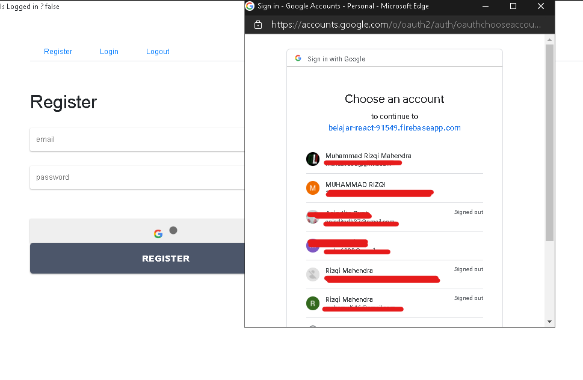
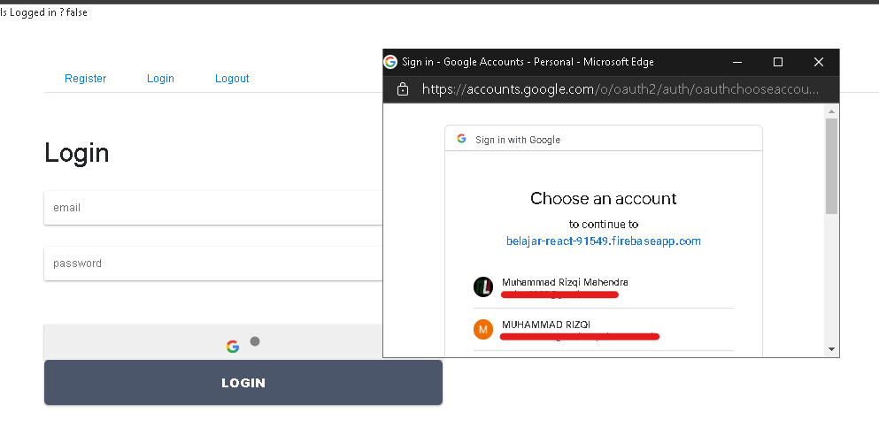
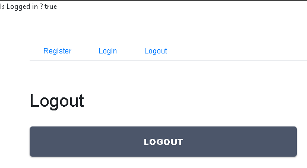
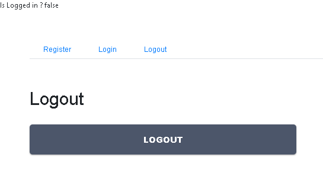
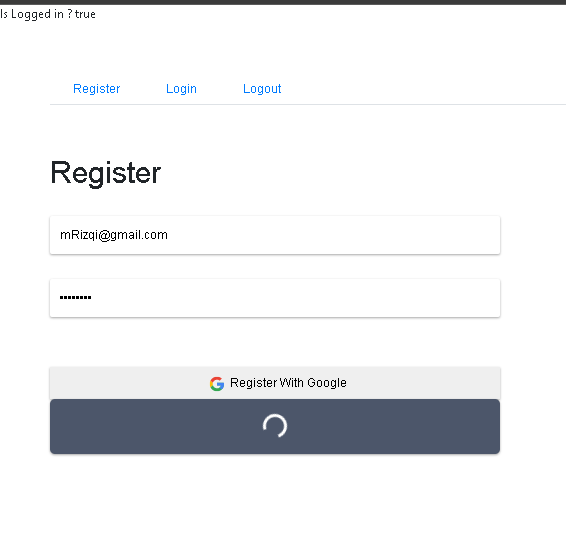
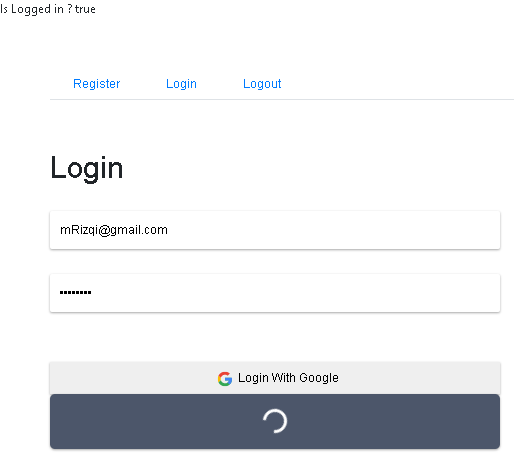

# Laporan Praktikum #10

## Tujuan Pembelajaran

1. Konsep dan implementasi Firebase di ReactJS

## Praktikum

### Praktikum 1: Membuat Form Register

`Screenshot:`  

  
`Kode Program:`  

* [Kode Program](../../src/10_firebase_reactjs/praktikum1/src)

### Praktikum 2: Membuat Form Login

`Screenshot:`  

  
`Kode Program:`  

* [Kode Program](../../src/10_firebase_reactjs/praktikum2/src)

### Praktikum 3: Membuat Koneksi ke Firebase

`Screenshot:`  

  
  
`Kode Program:`  

* [Kode Program](../../src/10_firebase_reactjs/praktikum3/src)

### Tugas Praktikum
### Login & Register With Google
`Screenshot:`  
  

### Logout  
`Screenshot:`  
  
  
### Loading
`Screenshot:`  
  
  

* [Kode Program](../../src/10_firebase_reactjs/tugas/src)
