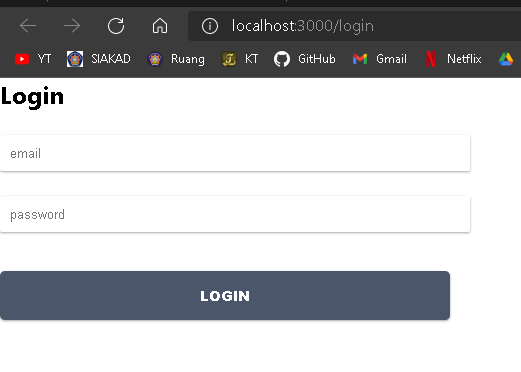
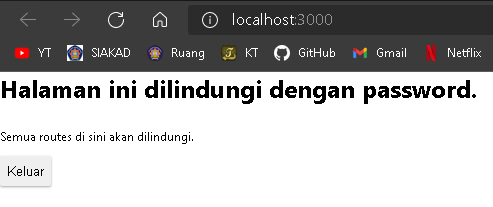
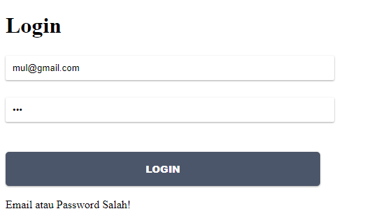
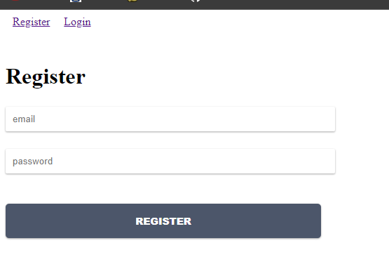
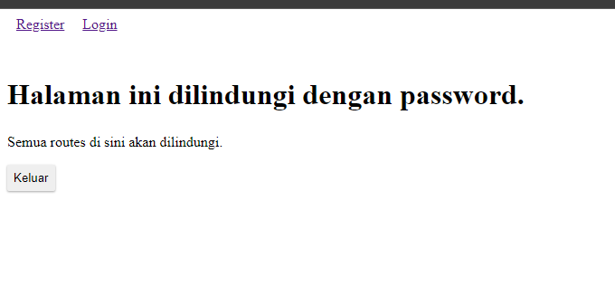

# 11 - Redux Thunk
## Tujuan Pembelajaran
- Konsep dan implementasi Redux-Thunk di ReactJS
- Konsep dan implementasi Firebase Login dengan Redux-Thunk di ReactJS

___
## Praktikum: Membuat Login dengan Firebase dan Redux Thunk

  
  

* [Kode Program](../../src/11_redux_thunk/praktikum1/src)

## Tugas Praktikum
1. Berdasarkan praktikum yang telah Anda lakukan, jelaskan perbedaan fitur yang ada dalam komponen Login dan Home! Mengapa komponen Login tidak menggunakan class seperti pada komponen Home ?  
`Jawab`  
Pada halaman login terdapat fitur isAuthenticated untuk melakukan pengecekan terhadap user dan karena pada bagian login memanfaatkan fitur useState, dimana dia tidak akan bisa dipanggil jika menggunakan class, apakah sudah login atau belum. Sedangkan dihalaman Home tidak ada  

2. Jelaskan kegunaan dan alur logika dari protectedRoute.js !  
`Jawab`  
pembungkus disekitar komponen Route yang disediakan oleh react-router.
protectedRoute dapat digunakan sebagai pengganti Route normal untuk membuat route terlindungi yang beraksi terhadap perubahan status otentikasi aplikasi.
3. Coba lakukan login dengan email atau password yang salah, apa yang terjadi? Jelaskan!  
`Jawab`  
Jika email atau password tidak sesuai akan mengeksekusi `loginError` dan muncul pesan `Email atau Password Salah!` seperti berukut:
  

4. Jika Anda berada di halaman Home, coba akses form login tanpa melakukan logout. Apakah form login bisa diakses? Jelaskan!  
`Jawab`  
Tidak bisa diakses. Karena terdapat auth, untuk mengakses login maupun register harus dalam keadaan isAuthenticated false

5. Tambahkan menu Register pada form login sehingga user yang belum terdaftar dapat melakukan registrasi! Jika registrasi sukses, maka user langsung diarahkan ke halaman Home.  
`Jawab`  
  
  

* [Kode Program](../../src/11_redux_thunk/tugas/src)
