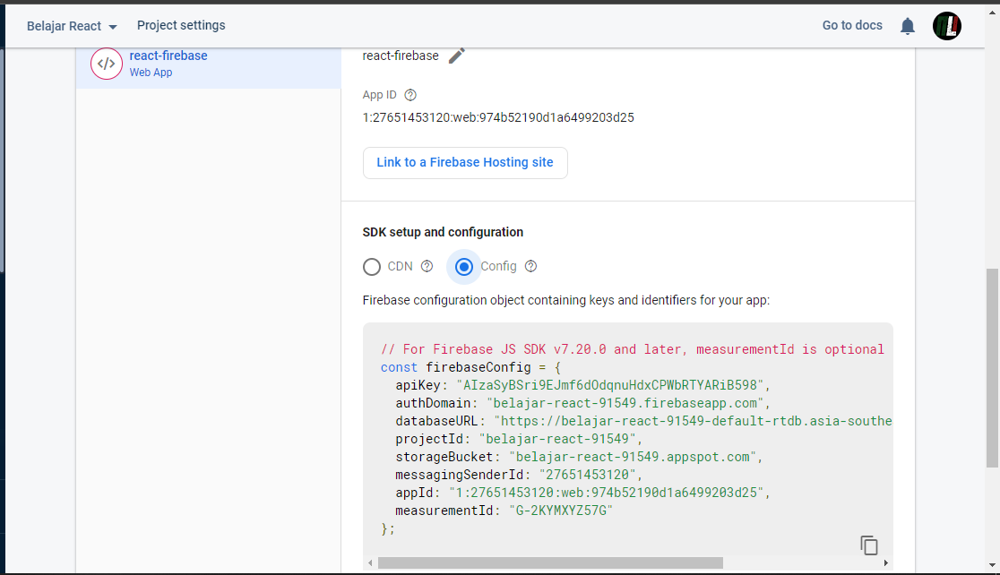
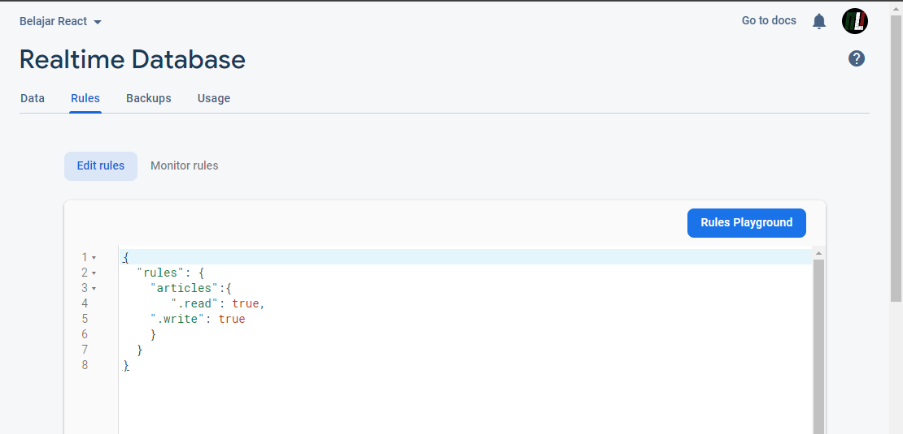
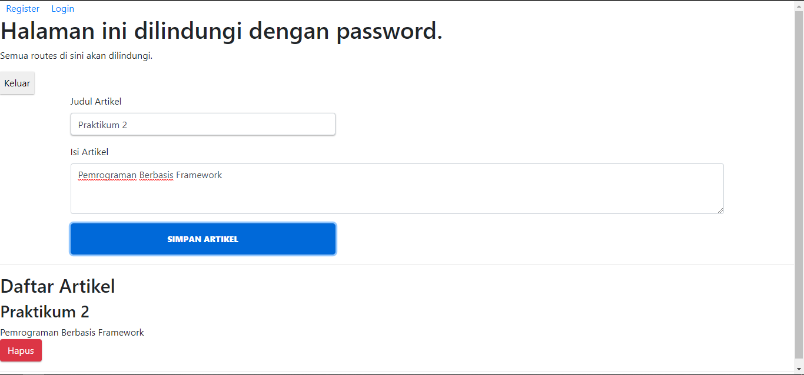
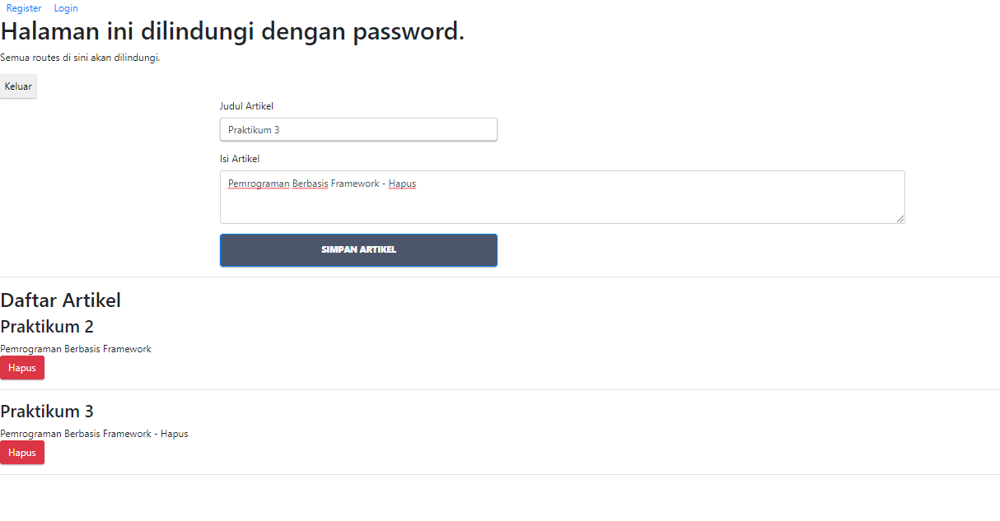
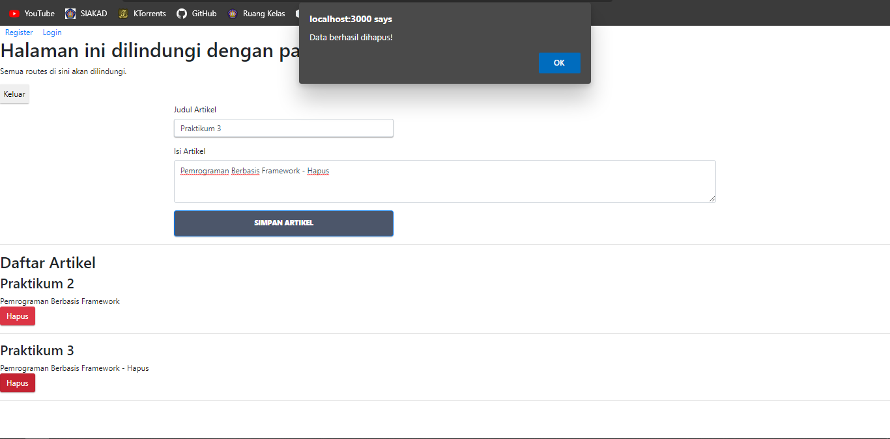
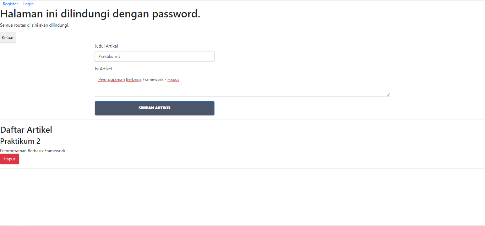
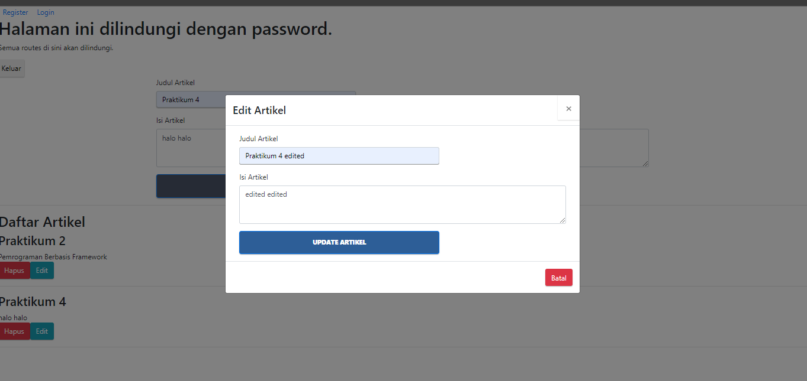
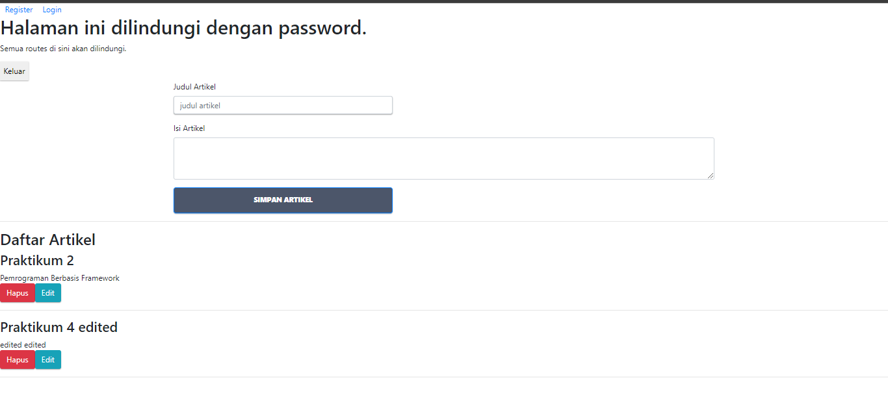
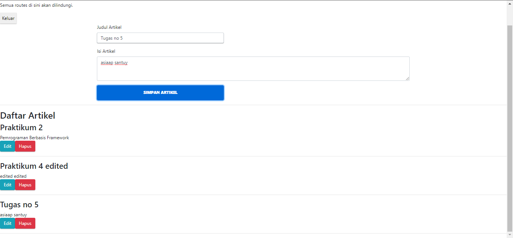

# 12 - CRUD Firebase
## Tujuan Pembelajaran

1. Mahasiswa memahami konsep redux thunk pada project ReactJS
2. Mahasiswa dapat melakukan instalasi dan konfigurasi redux thunk pada project ReactJS

## Hasil Praktikum
## Praktikum 1: Konfigurasi Database Firebase

## Praktikum 2: Membuat Fungsi Create Artikel

## Praktikum 3: Membuat Fungsi Hapus Artikel

  

  

## Praktikum 4: Membuat Fungsi Edit (Update) Artikel

  
  

## TUGAS
1. Berdasarkan praktikum 1 yang telah Anda lakukan, jelaskan perbedaan fungsi locked mode dan test mode pada langkah 3 saat Anda konfigurasi database Firebase?

    Jawab: 

2. Buatlah variabel userId pada praktikum 2 langkah 4 agar dapat menyimpan email dari user yang sedang login, sehingga dapat tersimpan di database!

    Jawab: 
       

3. Jelaskan maksud kode ini (dataArtikel || []) pada praktikum 2 langkah 6! Mengapa berbeda dari codelabs sebelumnya untuk menampilkan daftar artikel?

    Jawab: 
    
4. Lengkapilah kode pada praktikum 4 langkah 5 agar dapat melakukan update artikel! Mengapa setelah klik tombol Update Artikel, form Modal tidak hilang? Bagaimana Anda mengatasi hal tersebut?

    Jawab: 
    
5. Ketika Anda menekan tombol Edit, lalu menekan tombol Batal pada form Modal update artikel. Kemudian coba tambah artikel baru, maka artikel yang tadi kita klik tombol Edit akan berubah jadi data yang artikel baru ditambahkan. Mengapa demikian? Silakan diperbaiki.

    Jawab: 
      

[source code](../../src/12_crud_firebase/)